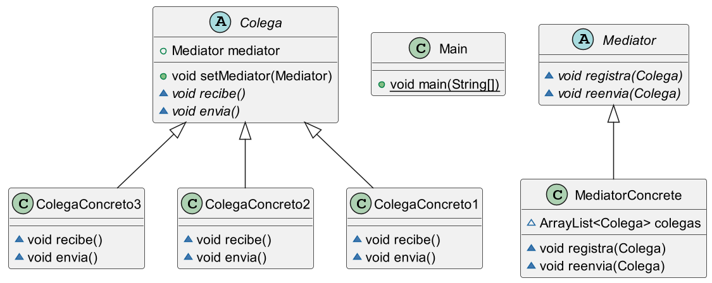

## Mediator Pattern Implementation

This project demonstrates the implementation of the Mediator design pattern. The Mediator pattern facilitates communication between multiple objects by introducing a mediator object, which handles the interactions between the different components. This pattern promotes loose coupling by preventing objects from referring to each other explicitly and makes the system easier to maintain and extend.

### Key Features:

Centralized Communication: All interactions between components are managed by a mediator, simplifying the relationships between objects.
Loose Coupling: Components do not need to be aware of the other components, only the mediator, making it easier to modify individual components without affecting others.
Improved Maintainability: By reducing dependencies between objects, the system becomes more modular and easier to maintain.
This project serves as a reference for understanding and implementing the Mediator pattern in real-world applications, promoting better design practices in complex systems.

## Mediator

También llamado: **Mediador, Intermediary, Controller**

Propósito
El patrón Mediator es un patrón de comportamiento que ayuda a reducir las dependencias directas entre objetos, lo que podría llevar a una red de relaciones complicada y difícil de gestionar. Este patrón fuerza a los objetos a colaborar a través de un mediador, en lugar de comunicarse directamente.

Fuente imagen: https://refactoring.guru/es/design-patterns/mediator

## Problema

Imagina un diálogo de creación y edición de perfiles de clientes que contiene varios controles, como campos de texto, casillas de verificación y botones. A medida que la aplicación crece, las relaciones entre estos controles pueden volverse caóticas. Por ejemplo, seleccionar una casilla puede desencadenar la aparición de nuevos campos, y un botón de envío podría necesitar validar todos los campos antes de proceder.

Relaciones caóticas entre elementos de la interfaz de usuario
Las relaciones entre los elementos de la interfaz de usuario pueden volverse caóticas cuando la aplicación crece.

Algunos de los elementos del formulario pueden interactuar con otros. Por ejemplo, al seleccionar la casilla “tengo un perro” puede aparecer un campo de texto oculto para introducir el nombre del perro. Otro ejemplo es el botón de envío que tiene que validar los valores de todos los campos antes de guardar la información.

## Solución

El patrón Mediator propone eliminar la comunicación directa entre los componentes, haciendo que estos interactúen a través de un objeto mediador. Esto significa que los componentes dependen solo del mediador, en lugar de estar fuertemente acoplados entre sí.

Torre de control del tráfico aéreo
Los pilotos de aviones no hablan directamente entre sí para decidir quién es el siguiente en aterrizar su avión. Todas las comunicaciones pasan por la torre de control.

Los pilotos de los aviones que llegan o salen del área de control del aeropuerto no se comunican directamente entre sí. En lugar de eso, hablan con un controlador de tráfico aéreo, que está sentado en una torre alta cerca de la pista de aterrizaje. Sin el controlador de tráfico aéreo, los pilotos tendrían que ser conscientes de todos los aviones en las proximidades del aeropuerto y discutir las prioridades de aterrizaje con un comité de decenas de otros pilotos. Probablemente, esto provocaría que las estadísticas de accidentes aéreos se dispararan.

La torre no necesita controlar el vuelo completo. Sólo existe para imponer límites en el área de la terminal porque el número de actores implicados puede resultar difícil de gestionar para un piloto.

## Estructura

Estructura del patrón de diseño Mediator
En el patrón Mediator, los componentes son clases que contienen lógica de negocio y están conectadas a una interfaz mediadora. El mediador se encarga de gestionar las interacciones entre los componentes, asegurando que estas relaciones estén encapsuladas y sean fáciles de gestionar.
La interfaz Mediadora declara métodos de comunicación con los componentes, que normalmente incluyen un único método de notificación. Los componentes pueden pasar cualquier contexto como argumentos de este método, incluyendo sus propios objetos, pero sólo de tal forma que no haya acoplamiento entre un componente receptor y la clase del emisor.

Los Mediadores Concretos encapsulan las relaciones entre varios componentes. Los mediadores concretos a menudo mantienen referencias a todos los componentes que gestionan y en ocasiones gestionan incluso su ciclo de vida.

Los componentes no deben conocer otros componentes. Si le sucede algo importante a un componente, o dentro de él, sólo debe notificar a la interfaz mediadora. Cuando la mediadora recibe la notificación, puede identificar fácilmente al emisor, lo cual puede ser suficiente para decidir qué componente debe activarse en respuesta.

Desde la perspectiva de un componente, todo parece una caja negra. El emisor no sabe quién acabará gestionando su solicitud, y el receptor no sabe quién envió la solicitud.

## Aplicabilidad

Este patrón es útil cuando las clases están fuertemente acopladas y es difícil modificarlas sin afectar a otras. Al implementar un mediador, puedes aislar cambios en un componente específico sin que afecten al resto. También es útil cuando los componentes no pueden reutilizarse fácilmente en otros programas debido a sus dependencias directas.

El patrón Mediator permite definir nuevas formas de colaboración entre componentes simplemente introduciendo nuevas clases mediadoras, sin necesidad de modificar los componentes existentes.

## Pros y contras

## Ventajas:

Simplifica la gestión de la comunicación entre componentes.
Facilita la reutilización de componentes en diferentes contextos.
Permite añadir nuevos mediadores sin modificar los componentes.

## Desventajas:

Con el tiempo, el mediador puede volverse demasiado complejo, concentrando demasiadas responsabilidades.
